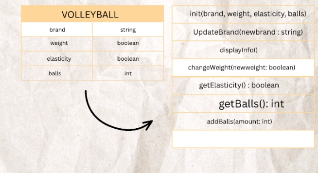
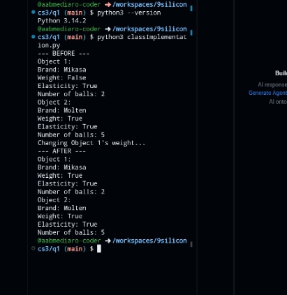

# Class Attributes and Methods
## Previous Design
Link to my previous activity:
[classObjectUML](classObjectUML.md)
## Design Revision
- Added public and private visibility to the attributes.
- Made 'elasticity' and 'balls' private to protect the object's internal information.
- Added '__init__()' to initialize the attributes of every new object.
- Added getter methods to safely read the private attributes.
- Added 'addBalls()` to safely modify the private ball count.
  
## Visibility Decisions
| Attribute | Data Type | Visibility | Reason |
|---|---|---|---|
| brand | string | public | Identifies the ball's brand and can be accessed normally |
| weight | boolean | public | Indicates whether the ball is heavy or not |
| elasticity | boolean | private | Protects the ball's elasticity information from direct changes |
| balls | int | private | Prevents the number of balls from being changed to an invalid value |
## Updated UML Class Diagram

## Python Implementation
[View Python Source](classImplementation.py)
## Test Run

## Object Diagram

## Analysis
### Why did you make your chosen attribute private?
- I made the balls and elasticity attributes private to protect the information inside the volleyball. If other parts of the program changed the number of balls directly, they might set it to an invalid value, such as negative number. Keeping these attributes private allows the class to control how the number of balls are changes.
### Which method changes the state of your object?
- The changeWeight() method changes the state of my object. It affects the weight attribute by assigning it a new boolean value. In my test run, Object 1's weight changed from False to True, while its other attributes stayed the same.
### How did your two objects demonstrate that instances are independent?
- My two objects, volleyball1 and volleyball2, were created from the same Volleyball class but had different values. When I changed Object 1's weight, Object 2's weight remained True and its other attributes were not changed.
### What is the difference between your class diagram and your object diagram?
- The class diagram shows the blueprint of the Volleyball class, including its attributes, data types, visibility, and methods. The object diagram shows the actual instances created from that class. In my project, the class diagram describes what possible volleyball object can have, while the object diagram shows the specific values of volleyball1 and volleyball2 after the method was executed.
